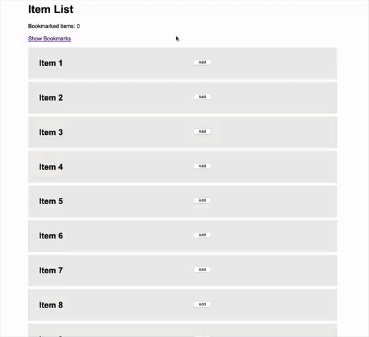

# Bookmarks Demo

**It's just a demo of handling bookmarks (or wish lists) with PHP and Cookies.** That's no final project but a source of inspiration if you're planning such thing in your next project.

## How it works
Item IDs where stored JSONified in a browser cookie and a PHP class manages adding and removing of these bookmark items. If JS is available, the addition or removal of items is done asynchronous without reloading the page – but if JS is **not** available, it will fall back nicely.